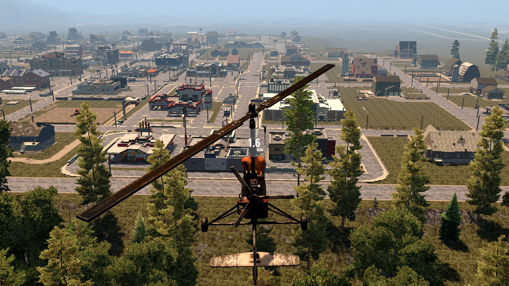

# OCB No Sudden Exit Mod - 7 Days to Die (V1.0 exp) Addon

Small Harmony Mod that shows a counter instead of instantly
exiting vehicles that are in the air. Not EAC compatible.

### Download and Install

End-Users are encouraged to download my mods from [NexusMods][2].  
Every download there helps me to buy stuff for mod development.

Otherwise please use one of the [official releases][1] here.  
Only clone or download the repo if you know what you do!

## Changelog

### Version 0.3.0

- First compatibility with V1.0 (exp)

### Version 0.2.0

- Update compatibility for 7D2D A21.0(b324)

### Version 0.1.0

- Initial version

[1]: https://github.com/OCB7D2D/OcbNoSuddenExit/releases
[2]: https://www.nexusmods.com/7daystodie/mods/1985
